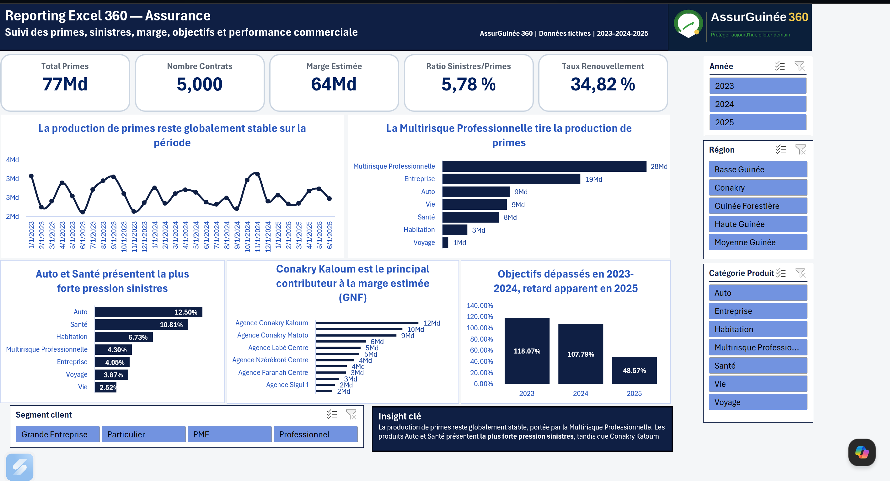

# Reporting Excel 360 — Assurance

## Contexte du projet

Ce projet est une déclinaison Excel d’un cas métier fictif appliqué au secteur de l’assurance en Guinée.

L’objectif est de construire un fichier de reporting professionnel permettant de suivre la performance commerciale et technique d’un portefeuille d’assurance à partir de plusieurs sources de données : contrats, clients, produits, agences, agents, sinistres et objectifs.

Le projet utilise des données fictives créées pour un usage portfolio.

---

## Objectif business

L’objectif du reporting est d’aider une compagnie d’assurance à répondre rapidement à des questions clés :

- Quel est le volume total de primes générées ?
- Quels produits contribuent le plus à la production de primes ?
- Quels produits présentent la plus forte pression sinistres ?
- Quelles agences contribuent le plus à la marge estimée ?
- Les objectifs de primes sont-ils atteints ?
- Quels filtres permettent d’analyser la performance par année, région, produit ou segment client ?

---

## Aperçu du dashboard



---

## Indicateurs suivis

Le dashboard permet de suivre les principaux KPIs suivants :

- Total des primes
- Nombre de contrats
- Marge estimée
- Ratio sinistres / primes
- Taux de renouvellement
- Objectif de primes ajusté
- Écart à l’objectif
- Taux d’atteinte de l’objectif

---

## Outils utilisés

- Microsoft Excel
- Power Query
- Power Pivot
- DAX
- Tableaux croisés dynamiques
- Graphiques croisés dynamiques
- Segments interactifs

---

## Modèle de données

Le modèle repose sur une logique de tables de dimensions et de tables de faits.

### Tables de dimensions

- Calendrier
- Clients
- Produits
- Agences
- Agents

### Tables de faits

- Contrats
- Sinistres
- Objectifs

Les relations permettent d’analyser les contrats, les primes, les sinistres et les objectifs selon plusieurs axes : temps, produit, agence, client et agent.

---

## Mesures principales

Les principales mesures créées dans Power Pivot sont :

- Total Primes
- Nombre Contrats
- Total Sinistres Réglés
- Total Commissions
- Marge Estimée
- Ratio Sinistres/Primes
- Taux Renouvellement
- Objectif Primes Ajusté
- Écart Objectif Primes Ajusté
- Taux Atteinte Objectif Primes Ajusté

---

## Insights clés

La production de primes reste globalement stable sur la période observée.

La Multirisque Professionnelle est le principal moteur de primes du portefeuille, devant les produits Entreprise et Auto.

Les produits Auto et Santé présentent la plus forte pression sinistres, ce qui peut nécessiter une surveillance technique plus renforcée.

Conakry Kaloum ressort comme le principal contributeur à la marge estimée.

Les objectifs de primes sont dépassés en 2023 et 2024, tandis que 2025 affiche un retard apparent qui doit être interprété avec prudence si l’année n’est pas complète.

---

## Fonctionnalités du dashboard

Le dashboard Excel intègre des filtres interactifs permettant d’analyser la performance selon :

- Année
- Région
- Catégorie produit
- Segment client

Ces segments permettent de naviguer dans les données sans modifier les tableaux sources.

---

## Structure du projet

```text
Reporting Excel 360_AssurGuinée 360/
│
├── donnees/
│   ├── Agences.csv
│   ├── Agents.csv
│   ├── Calendrier.csv
│   ├── Clients.csv
│   ├── Contrats.csv
│   ├── Objectifs.csv
│   ├── Produits.csv
│   └── Sinistres.csv
│
├── excel/
│   └── reporting_excel_360_assurance.xlsx
│
├── captures_ecran/
│   └── 01_dashboard_excel_360.png
│
├── documentation/
│
└── README.md

---

## Auteur

**Ousmane Tawel CAMARA**  
Data & BI Analyst

Projet réalisé dans le cadre de mon portfolio data, avec des données fictives appliquées au secteur de l’assurance.
